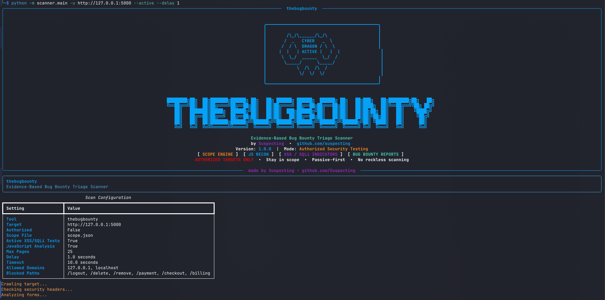
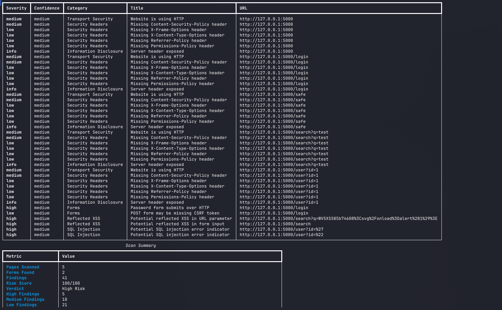
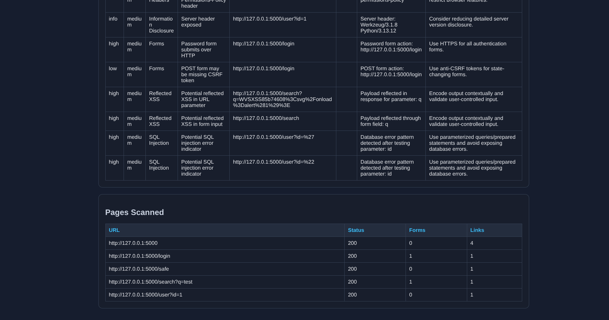
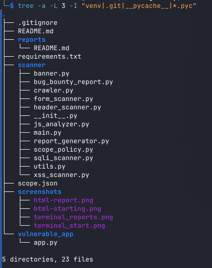

# thebugbounty

**thebugbounty** is an evidence-based bug bounty triage scanner for authorized web security testing. It performs scope-controlled crawling, passive security checks, JavaScript recon, reflected XSS indicator testing, SQL error indicator testing, confidence scoring, attack surface mapping, and professional report generation in JSON, HTML, and Markdown formats.

Created by **Prakhar Shakya**
GitHub: https://github.com/Suspecting

> This project is built for educational, defensive, and authorized security testing only.

---

## Overview

`thebugbounty` is designed as a professional cybersecurity project for learning web application security and bug bounty-style triage workflows.

Unlike a basic vulnerability scanner that only prints “XSS found” or “SQLi found,” this tool focuses on:

* Scope control
* Passive-first testing
* Authorization checks
* Evidence-based findings
* Confidence scoring
* JavaScript attack surface mapping
* Bug bounty-style Markdown reports
* JSON and HTML reporting
* Safe local vulnerable lab testing

The tool can be used against:

* Local test labs
* Personal web applications
* Staging environments
* CTF targets
* Bug bounty targets where scanning is explicitly permitted
* Systems where written authorization is available

---

## Important Disclaimer

This tool must only be used on systems you own, manage, or have explicit written permission to test.

Do **not** use this scanner on:

* Random public websites
* Banking websites
* Government portals
* University portals
* Login pages you do not own
* Production systems without permission
* Bug bounty targets where automated scanning is not allowed
* Out-of-scope domains or subdomains

The author is not responsible for misuse of this project.

---

## Key Features

### Core Scanner Features

* Same-host web crawling
* Scope-controlled scanning using `scope.json`
* Authorization guard for external targets
* Passive-first scan design
* Optional active testing with `--active`
* Blocked path protection
* Request delay control
* Maximum page limit
* Timeout control
* Rich-powered terminal interface
* Custom premium CLI banner

### Web Security Checks

* Security header analysis
* HTTP vs HTTPS detection
* Missing Content Security Policy detection
* Missing X-Frame-Options detection
* Missing X-Content-Type-Options detection
* Missing Referrer-Policy detection
* Missing Permissions-Policy detection
* Missing HSTS detection on HTTPS targets
* Exposed Server header detection

### Form Security Checks

* HTML form discovery
* Password form over HTTP detection
* Password form using GET detection
* External form action detection
* Missing form action detection
* POST form CSRF token indicator check

### Active Indicator Checks

Active checks only run when `--active` is used.

* Reflected XSS indicator testing
* GET parameter XSS reflection testing
* Form input XSS reflection testing
* SQL error indicator testing
* GET parameter SQL error testing
* Form input SQL error testing

### JavaScript Recon Features

* JavaScript file discovery
* JavaScript bundle fetching
* API endpoint extraction from JavaScript files
* Hidden route/path extraction
* Dangerous JavaScript sink detection
* Potential DOM XSS sink detection
* Source map exposure detection
* Potential frontend secret indicator detection

### Reporting Features

* JSON report generation
* HTML report generation
* Bug bounty-style Markdown report generation
* Risk scoring
* Confidence scoring
* Severity breakdown
* Attack surface map
* Evidence snippets
* Recommendations
* False positive notes

---

## Project Structure

```txt
thebugbounty/
│
├── scanner/
│   ├── __init__.py
│   ├── banner.py
│   ├── bug_bounty_report.py
│   ├── crawler.py
│   ├── form_scanner.py
│   ├── header_scanner.py
│   ├── js_analyzer.py
│   ├── main.py
│   ├── report_generator.py
│   ├── scope_policy.py
│   ├── sqli_scanner.py
│   ├── utils.py
│   └── xss_scanner.py
│
├── vulnerable_app/
│   └── app.py
│
├── reports/
│   └── README.md
│
├── screenshots/
│   └── README.md
│
├── scope.json
├── requirements.txt
├── .gitignore
└── README.md
```

---

## Module Breakdown

### `scanner/main.py`

Main CLI entry point.

Responsibilities:

* Parses command-line arguments
* Validates target URL
* Enforces authorization rules
* Loads `scope.json`
* Starts crawling
* Runs passive checks
* Runs JavaScript recon
* Runs active checks if `--active` is provided
* Generates reports
* Prints terminal summary

---

### `scanner/crawler.py`

Same-host crawler.

Responsibilities:

* Fetches pages
* Extracts links
* Extracts forms
* Stays within the same host
* Respects blocked paths from `scope.json`
* Applies request delay and page limit

---

### `scanner/scope_policy.py`

Scope enforcement engine.

Responsibilities:

* Loads `scope.json`
* Checks allowed domains
* Checks blocked paths
* Provides default max pages and delay
* Controls whether active tests are allowed

---

### `scanner/header_scanner.py`

Security header scanner.

Checks for:

* Missing `Content-Security-Policy`
* Missing `X-Frame-Options`
* Missing `X-Content-Type-Options`
* Missing `Referrer-Policy`
* Missing `Permissions-Policy`
* Missing `Strict-Transport-Security`
* HTTP usage
* Exposed `Server` header

---

### `scanner/form_scanner.py`

HTML form security scanner.

Checks for:

* External form actions
* Password forms over HTTP
* Password fields inside GET forms
* POST forms without CSRF token indicators
* Forms without action attributes

---

### `scanner/xss_scanner.py`

Reflected XSS indicator scanner.

Checks:

* GET parameter reflection
* Form input reflection
* Controlled payload reflection

This module does not claim browser-confirmed XSS. It reports reflected XSS indicators that require manual validation.

---

### `scanner/sqli_scanner.py`

SQL error indicator scanner.

Checks for database error patterns after sending safe quote-based test inputs.

Example indicators:

* SQL syntax error
* MySQL error strings
* PostgreSQL error strings
* SQLite error strings
* Oracle `ORA-` errors
* ODBC SQL Server errors

This module does not exploit SQL injection or extract data. It only detects error-based indicators.

---

### `scanner/js_analyzer.py`

JavaScript recon module.

Checks JavaScript files for:

* API endpoints
* Internal routes
* Source maps
* Possible frontend secrets
* Dangerous DOM sinks
* DOM XSS-related patterns

Examples of dangerous sinks:

```txt
innerHTML
outerHTML
document.write
eval(
setTimeout(
setInterval(
Function(
dangerouslySetInnerHTML
location.hash
location.search
```

---

### `scanner/report_generator.py`

Generates structured reports.

Outputs:

* JSON report
* HTML report
* Risk score
* Severity counts
* Confidence counts
* Attack surface map

---

### `scanner/bug_bounty_report.py`

Generates a bug bounty-style Markdown report.

Each finding includes:

* Title
* Severity
* Confidence
* Affected URL
* Parameter or field
* Payload used
* Evidence
* Impact
* Steps to reproduce
* Recommendation
* False positive notes

---

### `scanner/banner.py`

Premium terminal banner shown when the tool runs.

Includes:

* Tool name
* Author branding
* GitHub link
* Module highlights
* Authorized-use warning

---

### `vulnerable_app/app.py`

Local vulnerable Flask app for safe testing.

Includes test pages for:

* Reflected XSS
* SQL error indicators
* Login form analysis
* Safe page comparison

## Screenshots

### Bug Bounty Terminal



### Terminal Scan Output



### HTML Report




### Project Structure



---

## Installation

Clone the repository:

```bash
git clone https://github.com/Suspecting/thebugbounty.git
cd thebugbounty
```

Create a virtual environment:

```bash
python3 -m venv venv
source venv/bin/activate
```

Install dependencies:

```bash
pip install -r requirements.txt
```

---

## Requirements

```txt
requests
beautifulsoup4
flask
rich
```

---

## Running the Local Test Lab

Start the local vulnerable Flask app:

```bash
python vulnerable_app/app.py
```

The app will run at:

```txt
http://127.0.0.1:5000
```

Open it in your browser:

```txt
http://127.0.0.1:5000
```

Available test routes:

```txt
/             - Home page
/search?q=   - Reflected XSS test page
/user?id=    - SQL error indicator test page
/login       - Login form test page
/safe        - Safe page
```

---

## Basic Usage

### Passive Local Scan

```bash
python -m scanner.main -u http://127.0.0.1:5000
```

This performs:

* Crawling
* Header checks
* Form checks
* JavaScript recon
* Report generation

It does **not** run active XSS/SQLi payload checks.

---

### Active Local Scan

```bash
python -m scanner.main -u http://127.0.0.1:5000 --active
```

This performs passive checks plus:

* Reflected XSS indicator checks
* SQL error indicator checks

---

### Disable JavaScript Analysis

```bash
python -m scanner.main -u http://127.0.0.1:5000 --no-js
```

---

### Custom Page Limit and Delay

```bash
python -m scanner.main -u http://127.0.0.1:5000 --max-pages 10 --delay 1
```

---

## Authorized External Scanning

For external targets, the scanner requires two things:

1. The `--authorized` flag
2. The target domain must be listed in `scope.json`

Example:

```json
{
  "project_name": "thebugbounty",
  "allowed_domains": [
    "127.0.0.1",
    "localhost",
    "your-authorized-domain.com"
  ],
  "blocked_paths": [
    "/logout",
    "/delete",
    "/remove",
    "/payment",
    "/checkout",
    "/billing"
  ],
  "max_pages": 25,
  "delay": 1.0,
  "passive_first": true,
  "allow_active_tests": true
}
```

Run passive scan:

```bash
python -m scanner.main -u https://your-authorized-domain.com --authorized
```

Run active scan only when explicitly permitted:

```bash
python -m scanner.main -u https://your-authorized-domain.com --authorized --active
```

---

## Scope Policy

The `scope.json` file controls what the scanner is allowed to test.

Example:

```json
{
  "project_name": "thebugbounty",
  "allowed_domains": [
    "127.0.0.1",
    "localhost"
  ],
  "blocked_paths": [
    "/logout",
    "/delete",
    "/remove",
    "/payment",
    "/checkout",
    "/billing"
  ],
  "max_pages": 25,
  "delay": 1.0,
  "passive_first": true,
  "allow_active_tests": true,
  "notes": "Only scan targets you own, manage, or have written permission to test."
}
```

### Allowed Domains

Only domains listed in `allowed_domains` can be scanned.

### Blocked Paths

The scanner refuses to crawl paths such as:

```txt
/logout
/delete
/remove
/payment
/checkout
/billing
```

This helps prevent testing sensitive or destructive routes.

### Delay

Controls delay between requests.

### Max Pages

Controls maximum number of pages to crawl.

---

## Passive Mode vs Active Mode

### Passive Mode

Default mode.

Runs:

* Crawling
* Header analysis
* Form analysis
* JavaScript recon
* Report generation

Does not send XSS/SQLi test payloads.

### Active Mode

Enabled with:

```bash
--active
```

Runs passive checks plus:

* Reflected XSS indicator payloads
* SQL error indicator payloads

Use active mode only when the target owner or bug bounty program permits it.

---

## Report Output

Generated reports are saved in:

```txt
reports/
├── scan_YYYYMMDD_HHMMSS.json
├── html/
│   └── target_TIMESTAMP.html
└── bug_bounty/
    └── bug_bounty_report_TIMESTAMP.md
```

---

## JSON Report

The JSON report includes:

* Tool name
* Version
* Target URL
* Scan time
* Configuration
* Pages scanned
* Forms found
* Severity counts
* Confidence counts
* Risk score
* Attack surface map
* Full findings list

---

## HTML Report

The HTML report includes:

* Target summary
* Risk score
* Severity breakdown
* Confidence breakdown
* Attack surface map
* Findings table
* Pages scanned table

This report is useful for screenshots and project demonstrations.

---

## Bug Bounty Markdown Report

The Markdown report is designed to resemble a bug bounty submission format.

Each finding includes:

```txt
Title
Severity
Confidence
Category
Affected URL
Parameter or field
Payload used
Evidence
Impact
Steps to reproduce
Recommendation
False positive notes
```

This helps turn scanner results into a structured security report.

---

## Risk Scoring

Risk score is calculated from severity and confidence.

Severity weights:

```txt
Info      = 1
Low       = 5
Medium    = 15
High      = 30
Critical  = 50
```

Confidence adjusts the score:

```txt
High confidence    = full weight
Medium confidence  = partial weight
Low confidence     = reduced weight
```

Verdict ranges:

```txt
0-9      Informational
10-34    Low Risk
35-69    Medium Risk
70-100   High Risk
```

---

## Example Terminal Commands

Local passive scan:

```bash
python -m scanner.main -u http://127.0.0.1:5000
```

Local active scan:

```bash
python -m scanner.main -u http://127.0.0.1:5000 --active
```

Authorized external passive scan:

```bash
python -m scanner.main -u https://your-authorized-domain.com --authorized
```

Authorized external active scan:

```bash
python -m scanner.main -u https://your-authorized-domain.com --authorized --active
```

Limit pages and increase delay:

```bash
python -m scanner.main -u https://your-authorized-domain.com --authorized --max-pages 10 --delay 2
```

Disable JavaScript recon:

```bash
python -m scanner.main -u https://your-authorized-domain.com --authorized --no-js
```

---

## Example Finding Format

```json
{
  "severity": "high",
  "confidence": "medium",
  "category": "Reflected XSS",
  "url": "http://127.0.0.1:5000/search?q=test",
  "title": "Potential reflected XSS in URL parameter",
  "parameter": "q",
  "payload": "WVSXSS1234<svg/onload=alert(1)>",
  "evidence": "Payload reflected in response for parameter: q",
  "impact": "An attacker may execute JavaScript in a victim browser if the application does not encode user-controlled input.",
  "recommendation": "Apply contextual output encoding and validate user-controlled input.",
  "false_positive_notes": "Manual browser validation is required before reporting."
}
```

---

## Attack Surface Map

The scanner builds an attack surface map containing:

* Pages scanned
* Forms discovered
* JavaScript files
* API endpoints
* Possible secret indicators
* Dangerous JavaScript sinks
* Source maps

This helps security testers understand what was discovered before manually validating issues.

---

## JavaScript Recon Examples

The JavaScript analyzer can identify patterns such as:

```txt
/api/user/profile
/api/admin
/graphql
/v1/auth/login
/assets/app.js.map
innerHTML
dangerouslySetInnerHTML
api_key = "..."
client_secret = "..."
```

Not every finding is automatically a vulnerability. JavaScript recon findings require manual validation.

---

## Limitations

`thebugbounty` is not a replacement for professional tools like Burp Suite, OWASP ZAP, Nuclei, sqlmap, or browser-based dynamic analysis platforms.

Current limitations:

* Does not execute JavaScript like a real browser
* Does not fully support React/Vue/Angular rendered DOM analysis
* Does not perform authentication workflows
* Does not brute force parameters or directories
* Does not exploit vulnerabilities
* Does not bypass WAFs
* Does not perform blind SQL injection testing
* Does not confirm browser-executed DOM XSS
* May produce false positives
* Requires manual validation before reporting

---

## Future Enhancements

Planned upgrades:

* Playwright browser-rendered mode
* React/Vue/Angular DOM extraction
* DOM XSS source-to-sink tracing
* API endpoint clustering
* Open redirect indicator checks
* CORS misconfiguration checks
* Cookie security checks
* Screenshot capture for findings
* PDF report export
* Severity tuning configuration
* Burp Suite-compatible export
* YAML-based scan profiles
* Authentication/session support for owned targets
* GitHub Actions demo workflow
* Docker support

---

## Recommended Bug Bounty Workflow

1. Read the target program policy.
2. Confirm automated scanning is allowed.
3. Add only authorized domains to `scope.json`.
4. Start with passive mode.
5. Use low `--max-pages`.
6. Use safe delays.
7. Review generated reports.
8. Manually validate findings.
9. Remove false positives.
10. Submit only confirmed, in-scope vulnerabilities.

Example:

```bash
python -m scanner.main -u https://authorized-target.com --authorized --max-pages 10 --delay 2
```

Run active checks only if permitted:

```bash
python -m scanner.main -u https://authorized-target.com --authorized --active --max-pages 10 --delay 2
```

---

## Ethical Use

This project is intended for:

* Cybersecurity education
* Defensive testing
* Secure development practice
* Local lab testing
* Authorized bug bounty triage
* Portfolio and resume demonstration

This project is not intended for unauthorized scanning, exploitation, disruption, or abuse.

---

## Resume Description

**thebugbounty - Evidence-Based Bug Bounty Triage Scanner**

Developed an authorized Python-based bug bounty triage scanner with scope-controlled crawling, passive-first testing, JavaScript recon, reflected XSS and SQL error indicator checks, form security analysis, security header checks, confidence scoring, risk scoring, attack surface mapping, and JSON/HTML/Markdown report generation.

---

## Skills Demonstrated

```txt
Python
Web Security
Bug Bounty Methodology
XSS Testing
SQL Injection Indicators
JavaScript Recon
Security Headers
HTML Form Analysis
Scope Control
Report Generation
Risk Scoring
Flask
BeautifulSoup
Requests
Rich CLI
Cybersecurity Automation
```

---

## Author

**Prakhar Shakya**
GitHub: https://github.com/Suspecting

---

## License

This project is released for educational and defensive security use.

Copyright (c) [2026] [Prakhar Shakya]

Permission is hereby granted, free of charge, to any person obtaining a copy
of this software and associated documentation files (the "Software"), to deal
in the Software without restriction, including without limitation the rights
to use, copy, modify, merge, publish, distribute, sublicense, and/or sell
copies of the Software, and to permit persons to whom the Software is
furnished to do so, subject to the following conditions:

The above copyright notice and this permission notice shall be included in all
copies or substantial portions of the Software.

THE SOFTWARE IS PROVIDED "AS IS", WITHOUT WARRANTY OF ANY KIND, EXPRESS OR
IMPLIED, INCLUDING BUT NOT LIMITED TO THE WARRANTIES OF MERCHANTABILITY,
FITNESS FOR A PARTICULAR PURPOSE AND NONINFRINGEMENT. IN NO EVENT SHALL THE
AUTHORS OR COPYRIGHT HOLDERS BE LIABLE FOR ANY CLAIM, DAMAGES OR OTHER
LIABILITY, WHETHER IN AN ACTION OF CONTRACT, TORT OR OTHERWISE, ARISING FROM,
OUT OF OR IN CONNECTION WITH THE SOFTWARE OR THE USE OR OTHER DEALINGS IN THE
SOFTWARE.
